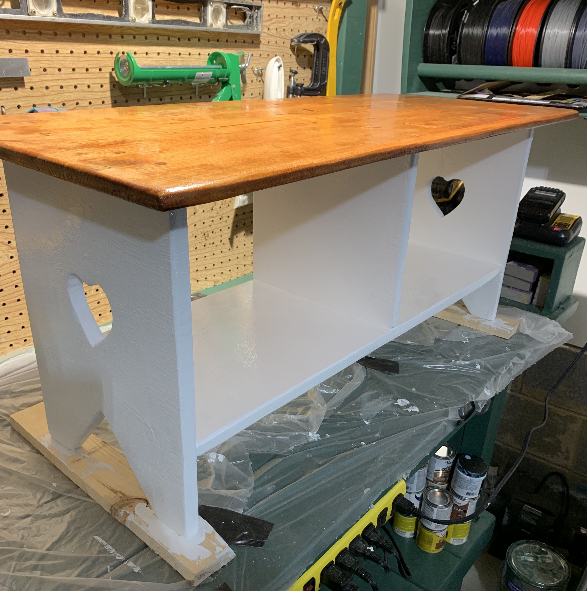

# Kitchen Bench

This repo has files for my Kitchen Bench project.

It includes a model file that can be opened with tinkercad and some hand drawn dimensions. My final product deviated slightly from these dimensions, but you should be able to use them as the basis for a similar project.

To use Tinkercad is free, you just setup an account with AutoDesk at [https://www.tinkercad.com/](https://www.tinkercad.com/dashboard).

This also goes along with my companion video on [Rhythm and Binary's YouTube Channel](https://www.youtube.com/channel/UCvAKKewP_o2l3XnwDzSxftw).

